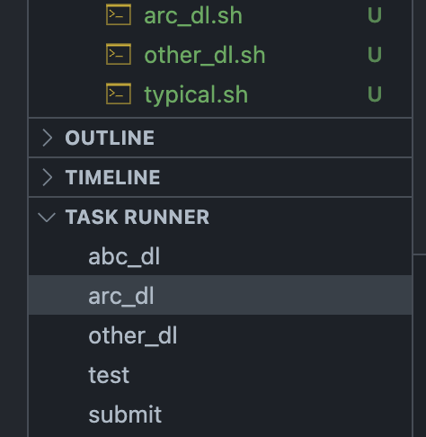
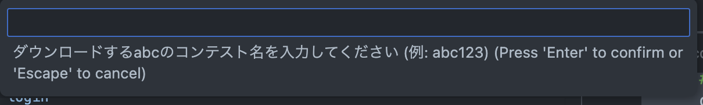
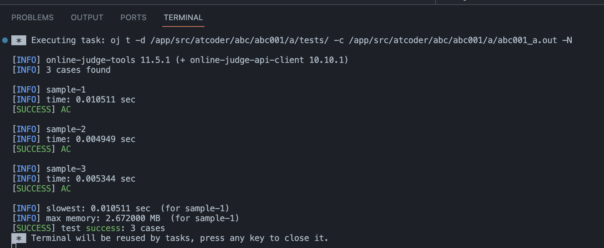
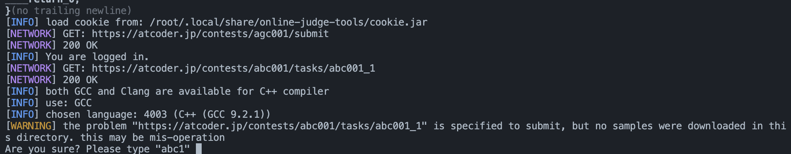

## AtCoder の環境を Docker で作りたい

**やりたいこと**

- AtCoder 用の`C++`を Docker で構築したい
- AtCoder の問題のテスト･提出を CLI でやりたい
- コマンドを VSCode のタスクを使って自動化したい

**ソースコード**

https://github.com/tf63/docker_images/tree/atcoder

**ディレクトリ構成**

```bash

    .
    ├── .devcontainer
    │   └── devcontainer.json
    ├── .vscode
    │   ├── c_cpp_properties.json
    │   └── tasks.json
    ├── cmd
    │   ├── abc_dl.sh
    │   ├── arc_dl.sh
    │   ├── other_dl.sh
    │   └── typical.sh
    ├── docker
    │   └── atcoder
    │       └── Dockerfile
    ├── docker-compose.yml
    ├── src
    │   └── atcoder
    │       ├── abc
    │       │   └── abc001
    │       ├── arc
    │       │   └── arc001
    │       └── other
    └── templates
        ├── atcoder.cpp
        └── input.txt
```

### 使用するツール

**online-judge-tools (oj)**

CLI で問題のダウンロードやテスト，提出をやってくれる

https://github.com/online-judge-tools/oj

**atcoder-cli (acc)**

oj での問題のダウンロードと提出をうまいことやってくれる

https://github.com/Tatamo/atcoder-cli/tree/develop

### 環境構築

**Docker コンテナの立ち上げ**

```
    docker compose up -d
```

**VSCode へのアタッチ**

`ctrl + shift + P`とかでコマンドパレットを開いて，`Dev Containers: Open Folder in Container...`を実行

  

**VSCode の拡張機能 Task Runner**

VSCode へのアタッチ時に拡張機能 `Task Runner` をインストールするように設定してある

これを使うと `.vscode/tasks.json`に登録されたタスクを GUI で実行できる

```tasks.json
    {
        "version": "2.0.0",
        "tasks": [
            {
                "label": "abc_dl",
                "type": "shell",
                "command": "${workspaceFolder}/cmd/abc_dl.sh ${input:abc_dl}",
                "presentation": {
                    "reveal": "always",
                    "focus": true,
                    "panel": "shared",
                },
            },
        (略)
```

  

### 初期設定

**acc, oj のログイン**

acc, oj で AtCoder のユーザー名とパスワードを入力してログインする

```bash
    # ダウンロードの確認
    acc check-oj
    # accのログイン
    acc login
    # ojのログイン
    oj login https://beta.atcoder.jp
```

**acc の設定の変更**

デフォルトで全部の問題がダウンロードされるようにしておく

```bash
    acc config default-task-choice all
```

### 問題のダウンロード

vscode のタスク`abc_dl`, `arc_dl`を実行すると，abc, arc 問題のダウンロードができる

- abc 問題のダウンロード -> `src/atcoder/abc/`にダウンロードされる
- arc 問題のダウンロード -> `src/atcoder/arc/`にダウンロードされる



結果

- `abc001/` -> A, B, C, ...問題のディレクトリ
- `abc001/a/test/` -> A 問題のテストケースがダウンロードされる
- `abc001/a/abc001_a.cpp` -> A 問題の解答ファイルが`/app/templates/atcoder.cpp`をコピーして作られる

```bash
└── src/atcoder/abc
　　        　    └── abc001
　　        　        │── a
　　        　        │    ├── abc001_a.cpp
　　        　        │    └── tests
　　        　        │        ├── sample-1.in
　　        　        │        ├── sample-1.out
　　        　        │        ├── sample-2.in
　　        　        │        ├── sample-2.out
　　        　        │        ├── sample-3.in
　　        　        │        └── sample-3.out
　　　　　　　　      　└── b
```

### テストの実行

解答用の cpp ファイルを開いて，vscode のタスク`test`を実行すると，例題でのテストが開始される



### 解答の提出

解答用の cpp ファイルを開いて，vscode のタスク`submit`を実行すると，自動で提出できる

(おそらく問題と一緒に作成された`contest.acc.json`をもとに提出先を決めている)



警告が出ているが問題ない，指示通り abc1 とか入力すれば OK

AtCoder の提出ページに行けば提出が確認できる

---

以上

---

### おまけ

**acc のインストール先**

`/lib/ac-library`

**c++の formatter の設定**

`.clang-format`でいじる

```.clang-format
    # デフォルト設定
    BasedOnStyle: Chromium
    # インデント幅
    IndentWidth: 4
    # 言語
    Language: Cpp
    Standard: Auto
    # 1行あたりの
    ColumnLimit: 120
```

**解答ファイルのテンプレート**

解答用の cpp ファイルは`./templates/atcoder.cpp`をコピーして作成される

`./cmd/abc_dl.sh`, `./cmd/arc_dl.sh`でテンプレートファイルを選択している

```cmd/abc_dl.sh
    TEMPLATE="${WORKDIR}/templates/atcoder.cpp"
    (略)
    cp -n $TEMPLATE "${DIRPATH}/$1_${DIRPATH##*/}.cpp"
```

**タスクをコマンドで実行する場合**

```
    ./cmd/abc_dl.sh abc123 # 問題のダウンロード
    oj t -d 問題のtests/へのパス -c 実行ファイル へのパス # 解答のテスト
    acc submit 提出するファイルへのパス # 解答の提出
```

### 参考

一連の流れ

https://qiita.com/Adaachill/items/3d4ddad56c5c2cc372cd

タスク(compile)

https://iconcreator.hatenablog.com/entry/2021/09/19/200000

タスク(submit, test)

https://blog.knshnb.com/posts/vscode-oj-acl/
