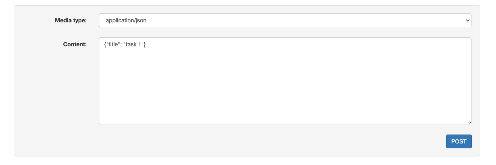
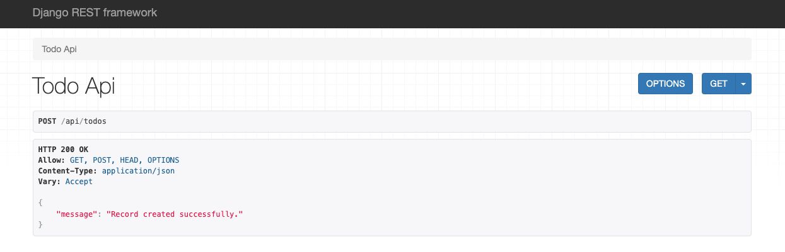
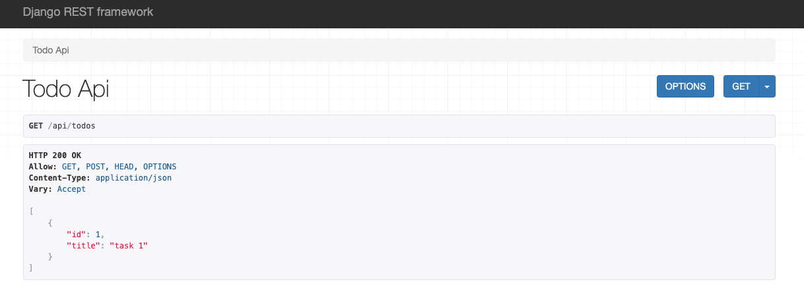
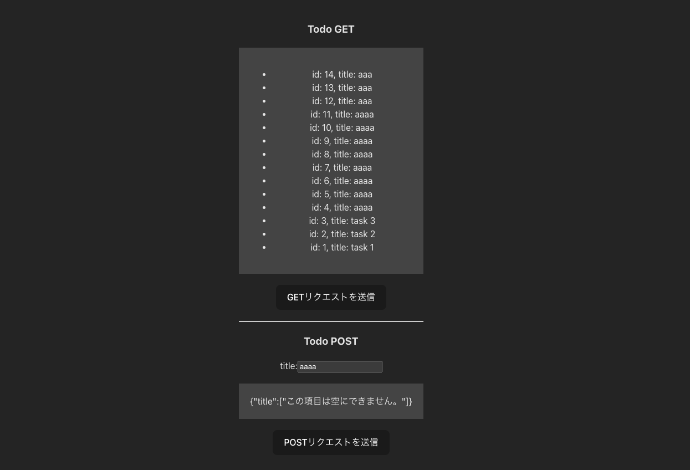

## Django REST Framework + React + Docker で Web アプリを作りたい

### 環境構築

**docker compose**

コンテナの起動

```bash
    docker compose up -d
```

コンテナの停止

```bash
    docker compose down
```

**docker compose exec のエイリアスを作成**

いちいち `docker compose exec` と打つのは面倒なので `dce`という名前のエイリアスを作ります

```cmd/docker_exec.sh
    #!/bin/bash
    alias dce="docker compose exec"
```

```bash
    # エイリアスの読み込み
    source ./cmd/docker_exec.sh
```

### Django プロジェクトの作成

**DJANGO_SECRET_KEY の作成**

```bash
    dce django python3
    >>> from django.core.management.utils import get_random_secret_key
    >>> get_random_secret_key()
```

**Django プロジェクトの作成**

backend という名前のプロジェクトを作成します

ディレクトリ構成が`src/backend/backend/manage.py`という感じになってしまうので，`src/backend/manage.py`となるように修正します

```bash
    dce django django-admin startproject backend
```

**Django アプリケーションの作成**

api という名前のアプリケーションを作成します

```bash
    dce django python manage.py startapp api
```

**初期マイグレーションの実行**

```bash
    dce django python manage.py makemigrations
    dce django python manage.py migrate
```

**settings.py の修正**

変更箇所のみを示します

```settings.py
    import os

    SECRET_KEY = os.getenv("DJANGO_SECRET_KEY")

    # SECURITY WARNING: don't run with debug turned on in production!
    if os.getenv("DEBUG") == "1":
        DEBUG = True
    else:
        DEBUG = False

    ALLOWED_HOSTS = os.environ.get("DJANGO_ALLOWED_HOSTS").split(" ")

    INSTALLED_APPS = [
        'django.contrib.admin',
        'django.contrib.auth',
        'django.contrib.contenttypes',
        'django.contrib.sessions',
        'django.contrib.messages',
        'django.contrib.staticfiles',

        # 3rd party
        'rest_framework',
        'corsheaders',

        # Local
        'api',
    ]

    MIDDLEWARE = [
        'django.middleware.security.SecurityMiddleware',
        'django.contrib.sessions.middleware.SessionMiddleware',
        'corsheaders.middleware.CorsMiddleware',
        'django.middleware.common.CommonMiddleware',
        'django.middleware.csrf.CsrfViewMiddleware',
        'django.contrib.auth.middleware.AuthenticationMiddleware',
        'django.contrib.messages.middleware.MessageMiddleware',
        'django.middleware.clickjacking.XFrameOptionsMiddleware',
    ]

    if DEBUG:
        CORS_ORIGIN_WHITELIST = [
            'http://localhost:5173',
            'http://127.0.0.1:5173',
        ]
    else:
        CORS_ORIGIN_WHITELIST = [
            'http://localhost'
        ]

    DATABASES = {
        "default": {
            "ENGINE": "django.db.backends.postgresql",
            "NAME": os.getenv("POSTGRES_NAME"),
            "USER": os.getenv("POSTGRES_USER"),
            "PASSWORD": os.getenv("POSTGRES_PASSWORD"),
            "HOST": "postgres",
            "PORT": 5432,
        },
    }

    LANGUAGE_CODE = "ja"

    TIME_ZONE = "Asia/Tokyo"
```

### Django REST Framework で Todo を管理する API を作成してみる

**ルーティング**

```backend/urls.py
    from django.contrib import admin
    from django.urls import path, include

    urlpatterns = [
        path('admin/', admin.site.urls),
        path("api/", include("api.urls")),
    ]
```

```api/urls.py
    from django.urls import path
    from api.views import TodoAPIView

    app_name = "api"

    urlpatterns = [
        path("todos", TodoAPIView.as_view(), name="todo")
    ]
```

**model の作成**

```api/models.py
    from django.db import models

    class Todo(models.Model):
        title = models.CharField(max_length=100, default="")

        def __str__(self):
            return f"{self.title}"
```

**serializer の作成**

```api/serializers.py
    from rest_framework import serializers
    from api.models import Todo

    class TodoSerializer(serializers.ModelSerializer):
        class Meta:
            model = Todo
            fields = "__all__"
```

**view の作成**

```api/views.py
    from rest_framework import status
    from rest_framework.views import APIView
    from rest_framework.response import Response

    from api.models import Todo
    from api.serializers import TodoSerializer

    class TodoAPIView(APIView):
        def get(self, request):
            try:
                # idの降順で最新の30件を取得
                queryset = Todo.objects.order_by("-id")[:30]
                serializer = TodoSerializer(queryset, many=True)

                return Response(serializer.data)
            except Exception as e:
                return Response(
                    {"error": str(e)}, status=status.HTTP_500_INTERNAL_SERVER_ERROR
                )

    def post(self, request):
        data = request.data

        serializer = TodoSerializer(data=data)
        if serializer.is_valid():
            # Save the record
            record = serializer.save()
            return Response({"message": "Record created successfully."})
        else:
            return Response(serializer.errors, status=status.HTTP_400_BAD_REQUEST)
```

### Django REST Framework の動作確認

`http://localhost:8000/api/todos`にアクセス

適当なタスクを POST してみる


POST のレスポンス


GET してみる


### React プロジェクトの作成

`vite` というビルドツールを使って TypeScript の React プロジェクトを作ります

```bash
    dce react yarn create vite . --template=react-ts
```

React プロジェクトが作成できたら`vite.config.ts`を修正しておきます

```vite.config.ts
    import { defineConfig } from "vite";
    import react from "@vitejs/plugin-react";

    // https://vitejs.dev/config/
    export default defineConfig({
        plugins: [react()],
        server: {
            host: true,
        },
    });
```

```bash
    dce react npm i axios
```

