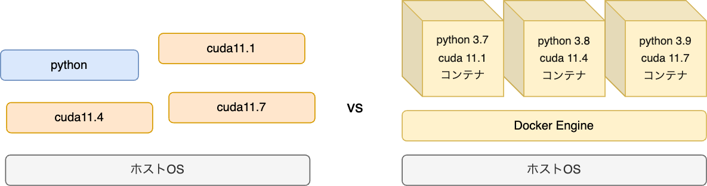
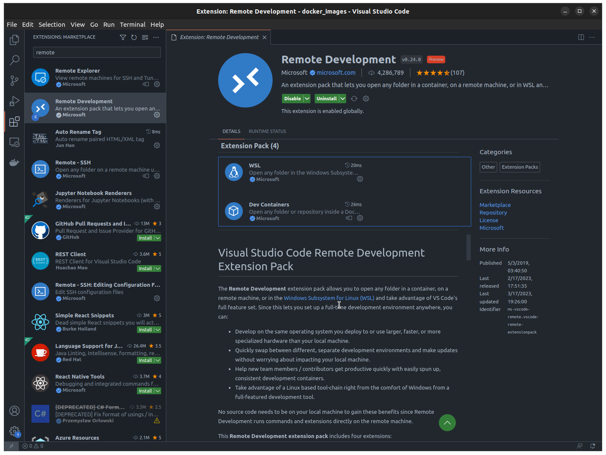
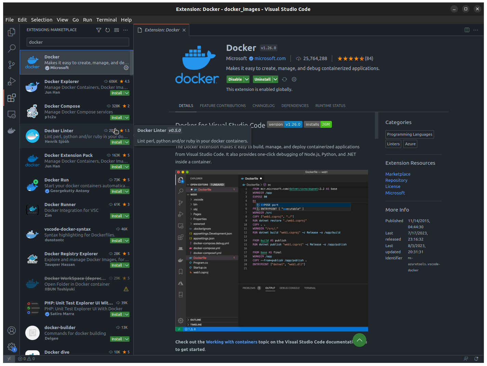
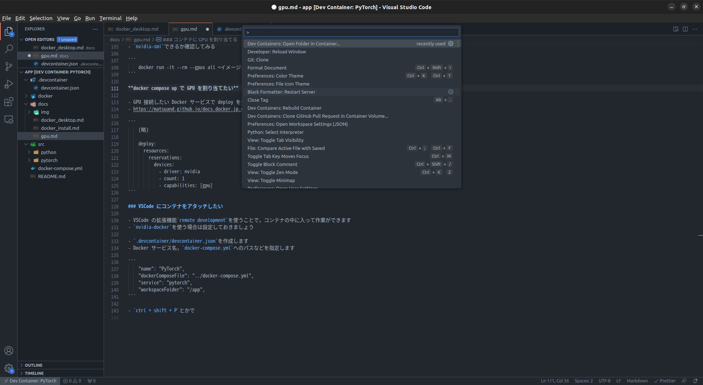
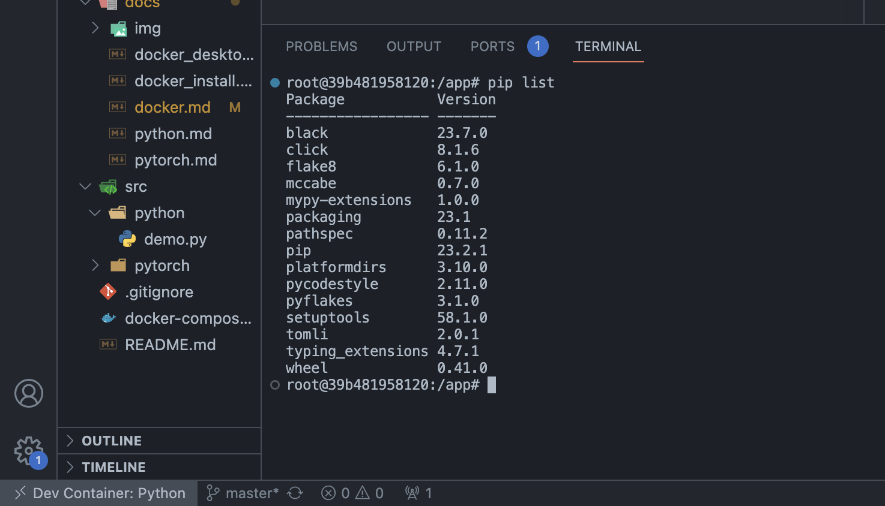
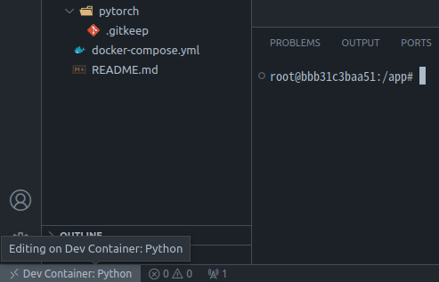

## Docker ってなんぞやという話 ~ Docker, Docker Compose のチュートリアル ~ VSCode の Remote Development まで

**ソースコード**

- https://github.com/tf63/docker_images/tree/python

**ディレクトリ構成**

```bash
    .
    ├── docker
    │   └── python
    │       ├── Dockerfile
    │       └── requirements.txt
    ├── docker-compose.yml
    └── src
        └── python
            └── demo.py
```

### 話の流れ

- なぜ Docker を使いたい?
- Docker はどんなもの?
- Docker コンテナが作成される仕組み
- Docker コンテナからホスト OS のファイルを参照するには?
- Docker のチュートリアル
- Docker Compose のチュートリアル
- VSCode の Remote Development を使う

## Docker ってなんぞや?

### なぜ Docker を使いたい?

- 環境を容易に共有できる
- 環境を容易に作り直せる
- 複数バージョンの環境を共存できる
- 再利用性が高い
- ホストの環境を汚さない
- 開発環境と本番環境の差を吸収してくれる

など

### Docker はどんなもの?

`Docker Engine` が OS (ホスト) の上にコンテナ (小さい OS みたいなもの) を作成する

コンテナ内でプログラムを実行する -> ホスト OS の環境に影響が及ばない



### Docker コンテナが作成される仕組み

- `Dockerfile` から Docker イメージを作成
- Docker イメージから Docker コンテナを作成


`Dockerfile` はソースコードであり Git 管理できる

- 再利用性が高く，配布も楽

- 環境の内容を後から確認できる

Docker イメージは [Docker hub](https://hub.docker.com/) のようなレジストリで配布される

- `Dockerfile` を作る際のベースイメージにして利用したりする

### Docker コンテナからホスト OS のファイルを参照するには?

基本的に次の 3 つのアプローチがある

**bind マウント**

- ホスト OS のディレクトリをコンテナにマウントする
- ホスト側でもファイルを参照したい場合に使う．ホストとコンテナ内でファイルの変更は同期されている

**volume マウント**

- `Docker Engine` が 暗黙的に volume という領域を作成し，コンテナにマウントする
- DB のデータなど，ホスト側で参照する必要のないファイルをマウントする事が多い

**`Dockerfile`でホストのディレクトリをコンテナ内にコピーする**

- 詳しくないがコンテナごとデプロイする場合とかに使う?

今回は **bind マウント**をする

## Docker を使ってみる

Docker を使って`python3.9`の環境を作ってみる

`requirements.txt`から`pip`で以下のパッケージをインストールしてみる

```requirements.txt
    # requirements.txt
    flake8
    black
```

**Dockerfile の例**

```Dockerfile
    FROM python:3.9 # ベースイメージの選択

    WORKDIR /app # コンテナ内のワークディレクトリの宣言
    COPY docker/python/requirements.txt /app # ホストのファイルをコンテナ内にコピー

    # コマンドの実行 (pip)
    RUN pip install --no-cache-dir --upgrade pip && \
        pip install --no-cache-dir -r requirements.txt # コピーしたrequirements.txtからインストール
```

**ベースイメージ**

`Dockerfile` からビルドする Docker イメージの元

- `FROM python:3.9`としているが，これは [Docker hub](https://hub.docker.com/) に登録されているイメージを指す

  - イメージには名前 `python` とタグ `3.9` を指定することができる

  - 名前 `python` の部分は[ここ](https://hub.docker.com/_/python) に対応

  - タグ `3.9` の部分は[ここ](https://hub.docker.com/_/python/tags) に対応

基本的にフレームワークやプログラミング言語は公式がイメージを配布しているため，それをベースイメージとして `Dockerfile` を作ることになる

`Alpine` や `Ubuntu` の公式イメージから `Dockerfile` を構築することもできる

**ファイルのコピー**

`COPY` 句でホスト側のファイルをコンテナ内にコピーできる

**コマンドの実行**

`RUN` 句でコマンドを実行できる

**他**

環境変数の宣言，コンテナのポートの開放，エントリポイントの設定など，色々できるが今回はここまで

### Dockerfile のビルド

(実際には `docker compose` を使ってビルドしたほうが楽なので覚えなくとも良い)

`Dockerfile` をビルドして Docker イメージを作成する

```bash
    docker build . -f docker/python/Dockerfile -t python_demo:1.0
```

- 現在ローカルにベースイメージ `python:3.9` は存在しないが，`docker build` をすると勝手に [Docker hub](https://hub.docker.com/) から探してきてくれる (`docker pull` してくれる)

- `docker build` の引数 (今回は`.`) には `Dockerfile` へのパスではなくビルド時のコンテキストというものを渡している

  - `Dockerfile` 内で`COPY docker/python/requirements.txt /app`とかしている

  - `docker/python/requrements.txt`はコンテキストからみた相対パスのこと

  - 現在は`.` (カレントディレクトリ) をコンテキストとしているので，カレントディレクトリにある`docker/python/requirements.txt`が参照される

- `-f`オプションで， `Dockerfile` へのパスを指定する
- `-t`オプションで，イメージ名を指定する (タグ `1.0` は無くても良い)

### Docker イメージの確認

```bash
    docker image ls
```

作成した Docker イメージ `python_demo` が確認できるはず

```
    REPOSITORY                        TAG             IMAGE ID       CREATED        SIZE
    (略)
    python_demo                       1.0             028d76d80330   2 hours ago    1.02GB
```

### Docker コンテナの起動

作成した Docker イメージ `python_demo:1.0` から Docker コンテナを起動してみる

```bash
    docker run -dit --name python_demo_container --volume "PWD":/app python_demo:1.0
```

- `--name` オプションで，コンテナ名を指定
- `--volume` オプションで，カレントディレクトリを`/app`に bind マウント
- `-dit` オプションはひとまず無視

### コンテナ内でコマンドを実行

`docker exec` でコンテナ内でコマンドを実行できる

`python_demo_container` コンテナで `pip list` を実行してみる

```bash
    docker exec python_demo_container pip list
```

`requirements.txt` に書いておいた `black` と `flake8` がインストールされている

```
        Package           Version
    ----------------- -------
    black             23.7.0
    (略)
    flake8            6.1.0
    (略)
```

## Docker Compose を使ってみる

### なぜ Docker Compose を使いたい?

- `docker build` や `docker run` コマンドが長い

  - コンテナの立ち上げもファイル (`docker-compose.yml`) から立ち上げるようにしたい

- 複数のコンテナを一括で立ち上げたい

  - 例えば，`Django` アプリケーションコンテナ，`Postgres` データベースコンテナ，`Nginx` サーバーコンテナを同時に立ち上げて通信するような場合

### Docker Compose を使う

`docker compose` は `docker-compose.yml` ファイルでコンテナの構成を宣言し，`docker compose up` でコンテナを起動できる

**docker-compose.yml の例**

```docker-compose.yml
    version: '3.3'

    services:
        python:
            build:
                context: . # ビルド時のコンテキスト
                dockerfile: docker/python/Dockerfile # Dockerfileへのパス
            container_name: 'python' # コンテナ名
            stdin_open: true # ditのどれか
            tty: true # ditのどれか
            volumes: # bindマウント
                - ./:/app

        # 例なのでコメントアウトしておく
        # postgres:
        #     image: postgres:15.2 # ベースイメージを直接指定 (Dockerfileからビルドしない)
        #     volumes: # volumeマウント
        #         - postgres_data:/var/lib/postgresql/data
        #     ports: # ホストのポートとコンテナのポートをフォワーディング
        #         - 5432:5432
        #     env_file: # 環境変数を.envというファイルから設定する
        #         - .env

    # volumeの宣言，Docker EngineがホストOSのどこかに領域を作成する
    # volumes:
        # postgres_data:

```

コンテナの起動

```bash
    # -d はバックグラウンドでコンテナを起動するという意味
    docker compose up -d
```

## Remote Development を使ってみる

VSCode の拡張機能 `Remote Development` と `Docker` を使うことで，コンテナの中に入って VSCode 上で作業ができる (VSCode にアタッチできる)

  
  

`Remote Development` では VSCode のワークディレクトリに `.devcontainer/devcontainer.json` を作成することでコンテナを VSCode にアタッチする

**devcontainer.json の例**

Docker サービス名，`docker-compose.yml`へのパスなどを指定する

```devcontainer.json
    {
        "name": "Python",
        "dockerComposeFile": "../docker-compose.yml",
        "service": "python",
        "workspaceFolder": "/app"
    }
```

**VSCode へのアタッチ**

`ctrl + shift + P`とかでコマンドパレットを開いて，`Dev Containers: Open Folder in Container...`を実行

  

ターミナルを開くとコンテナの中に入っていることが確認できる

  

コンテナから抜ける場合は左下の`Dev Container: Python`をクリックして，`Close Remote Connection`を実行

  

---

以上
