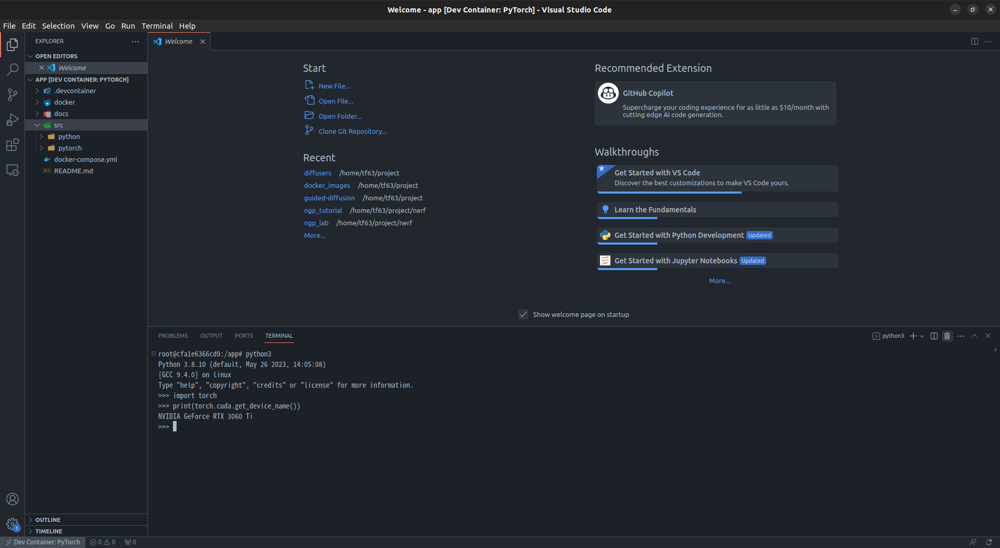

### Docker ってなんぞやという話 ~ Docker, Docker Compose のチュートリアル ~ VSCode の Remote Development まで

- ソースコード https://github.com/tf63/docker_images

- ディレクトリ構成

```
    .
    ├── docker
    │   └── python
    │       ├── Dockerfile
    │       └── requirements.txt
    ├── docker-compose.yml
    └── src
        └── python
            └── demo.py
```

**なぜ Docker?**

- 環境を容易に共有できる
- 環境を容易に作り直せる
- 複数バージョンの環境を共存できる
- 再利用性が高い
- ホストの環境を汚さない
- など

**Docker は何をする?**

- OS (ホスト) の上にコンテナ (小さい OS みたいなもの) を作成する
- コンテナ上でプログラムを実行する -> ホスト OS の環境に影響が及ばない


**Docker コンテナが作成される仕組み**

- `Dockerfile` から Docker イメージを作成
- Docker イメージから Docker コンテナを作成


`Dockerfile`

- ソースコード
- Git 管理できる
- 一度作ってしまえば再利用が容易
- 環境の内容を後から確認できる

`Dockerイメージ`

- ソースコードではない
- [Docker hub](https://hub.docker.com/) のようなレジストリで配布される
- `Dockerfile` を作る際のベースイメージにして利用したりする
- Docker コンテナから Docker イメージを作成することもできる

### Docker を使ってみる

**Dockerfile の例**

```Dockerfile
    FROM python:3.9 # ベースイメージの選択

    WORKDIR /app # コンテナ内のワークディレクトリの宣言
    COPY docker/python/requirements.txt /app # ホストのファイルをコンテナ内にコピー

    # コマンドの実行 (pip)
    RUN pip install --no-cache-dir --upgrade pip && \
        pip install --no-cache-dir -r requirements.txt # コピーしたrequirements.txtからインストール
```

```requirements.txt
    # requirements.txt
    flake8
    black
```

- 何をやっているのか?

`ベースイメージ`

- `Dockerfile`から作成する Docker イメージのもと
- `FROM python:3.9`としているが，これは [Docker hub](https://hub.docker.com/) に登録されているイメージを指す
- イメージには名前 `python` とタグ `3.9` を指定することができる
- 名前 `python` の部分は[ここ](https://hub.docker.com/_/python) に対応
- タグ `3.9` の部分は[ここ](https://hub.docker.com/_/python/tags) に対応

- 基本的にフレームワークやプログラミング言語は公式がイメージを配布しているため，それをベースイメージとして `Dockerfile` を作ることになる
- 一応 `Alpine` や `Ubuntu` のイメージから `Dockerfile` を構築することもできる

`ファイルのコピー`

- 特に指定せずにビルドした場合，コンテナ内にはホスト側のファイルが含まれていない
- `COPY` 句でホスト側のファイルをコンテナ内にコピーできる

`コマンドの実行`

- `RUN` 句でコマンドを実行できます

`他`

- 環境変数の宣言，コンテナのポートの開放，エントリポイントの設定など色々できるが，今回はここまで

**Dockerfile のビルド**

- 実際には `docker compose` を使ってビルドするので覚えなくとも良い
- `Dockerfile` をビルドして Docker イメージを作成する

```
    docker build . -f docker/python/Dockerfile -t python_demo:1.0
```

- 現在ローカルに ベースイメージ `python:3.9` は存在しないが，`docker build` をすると勝手に [Docker hub](https://hub.docker.com/) から探してきてくれる (`docker pull`してくれる)

- 引数には `Dockerfile` へのパスではなくビルド時のコンテキストというものを渡している

  - `Dockerfile` 内で`COPY docker/python/requirements.txt /app`とかしている

  - `docker/python/requrements.txt`はコンテキストからみた相対パスのこと

  - つまり，現在は`.` (カレントディレクトリ) をコンテキストとしているので，カレントディレクトリにある`docker/python/requirements.txt`が参照される

- `-f`オプションで， `Dockerfile` へのパスを指定する
- `-t`オプションで，イメージ名を指定する (タグ `1.0` は無くても良い)

**Docker イメージの確認**

```
    docker image ls
```

- 作成した Docker イメージ `python_demo` が確認できるはず

```
    REPOSITORY                        TAG             IMAGE ID       CREATED        SIZE
    (略)
    python_demo                       1.0             028d76d80330   2 hours ago    1.02GB
```

**Docker コンテナの起動**

- 作成した Docker イメージから Docker コンテナを起動してみる
- `--name` オプションで，コンテナ名を指定
- `--volume` オプションで，カレントディレクトリを`/app`にマウント
- `-dit` オプションはひとまず無視

```
    docker run -dit --name python_demo_container --volume "PWD":/app python_demo:1.0
```

**コンテナ内でコマンドを実行**

- `docker exec` でコンテナ内でコマンドを実行できる
- `python_demo_container` というコンテナで `pip list` を実行してみる

```
    docker exec python_demo_container pip list
```

- `requirements.txt` に書いておいた `black` と `flake8` がインストールされている

```
        Package           Version
    ----------------- -------
    black             23.7.0
    (略)
    flake8            6.1.0
    (略)
```

### Docker Compose

- Docker を使っていると複数のコンテナを同時に立ち上げたいことがある
- 例えば，`Django` アプリケーションコンテナ，`Postgres` データベースコンテナ，`Nginx` サーバーコンテナを同時に立ち上げて通信したいような場合
- `docker compose` は `docker-compose.yml` ファイルでコンテナの構成を宣言し，`docker compose up` でコンテナを起動できる

- `docker-compose.yml` の例

```docker-compose.yml
    version: '3.3'

    services:
        python:
            build:
                context: .
                dockerfile: docker/python/Dockerfile
            container_name: 'python'
            stdin_open: true
            tty: true
            volumes:
                - ./:/app

        # 例なのでコメントアウトしておく
        # postgres:
        #     image: postgres:15.2
        #     volumes:
        #         - postgres_data:/var/lib/postgresql/data
        #     ports:
        #         - 5432:5432
        #     env_file:
        #         - .env

```

- 起動

```
    # -d はバックグラウンドでコンテナを起動するという意味
    docker compose up -d
```

- `docker compose` であれば，長い `docker build`, `docker run`コマンドをいちいち打つ必要がない
- 単独のコンテナでも `docker compose` を使ったほうが楽

### Remote Development

- VSCode の拡張機能`remote development` と `docker`を使うことで，コンテナの中に入って VSCode 上で作業ができる

  
  

- `.devcontainer/devcontainer.json`を作成
- Docker サービス名，`docker-compose.yml`へのパスなどを指定

```
    "name": "Python",
    "dockerComposeFile": "../docker-compose.yml",
    "service": "python",
    "workspaceFolder": "/app",
```

- `ctrl + shift + P`とかでコマンドパレットを開いて，`Dev Containers: Open Folder in Container...`を実行

  

- アタッチ後は次のようになる
- ターミナルを開くとコンテナの中に入っていることが確認できる

  

- コンテナから抜ける場合は左下の`Dev Container: Python`をクリックして，`Close Remote Connection`を実行

  

---

以上
