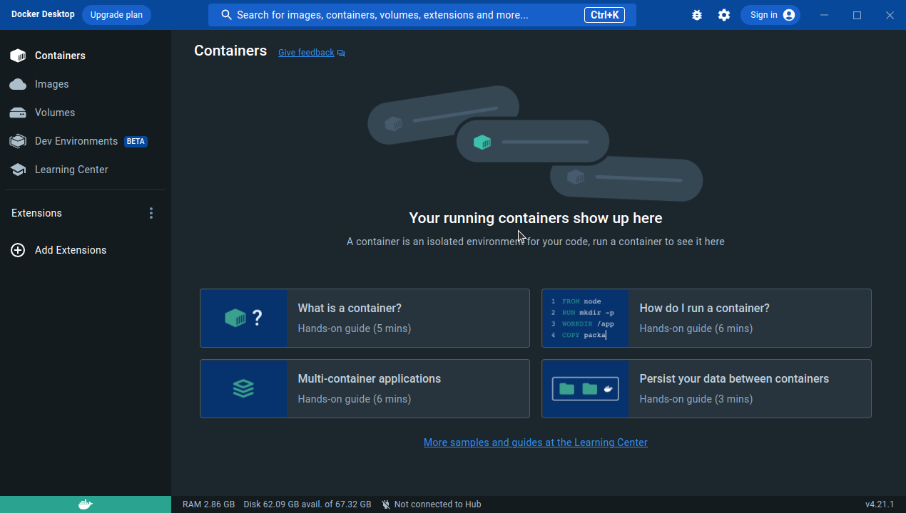

### 備考: Docker Desktop をインストールする場合

- nvidia-docker の場合は非推奨です

**Docker Desktop のインストール**

- (参考) https://docs.docker.com/desktop/install/ubuntu/

- Deb パッケージを[公式サイト](https://docs.docker.com/desktop/install/ubuntu/)からダウンロード

- Deb パッケージをインストール

```
    sudo apt-get update
    sudo apt-get install path/to/docker-desktop-<version>-<arch>.deb
```

- Docker Desktop がインストールされてます
- ログインとかはしなくとも大丈夫です
  
