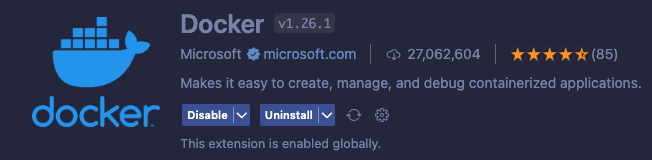
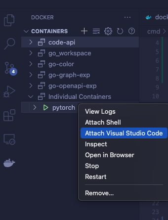
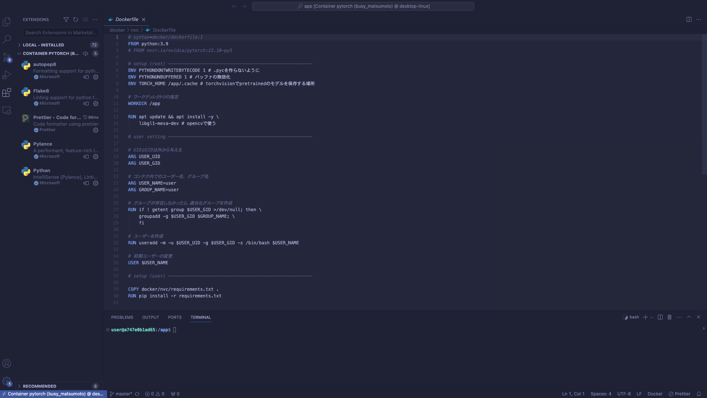

# nvidia-dockerのベストプラクティスを目指してみる
随時更新します

nvidia-dockerの導入
- https://qiita.com/tf63/items/618f192a810c28e4d2b7

ディレクトリ構成
```bash
.
├── .vscode
│   ├── extensions.json
│   └── settings.json
├── docker.sh
└── docker
    └── nvc
        ├── Dockerfile
        └── requirements.txt
```

### Dockerfile

```Dockerfile
# syntax=docker/dockerfile:1
FROM nvcr.io/nvidia/pytorch:22.10-py3

# setup (root) ------------------------------------------------------
ENV PYTHONDONTWRITEBYTECODE 1 # .pycを作らないように
ENV PYTHONUNBUFFERED 1 # バッファの無効化
ENV TORCH_HOME /app/.cache # torchvisionでpretrainedのモデルを保存する場所

# ワークディレクトリの指定
WORKDIR /app

RUN apt update && apt install -y \
    libgl1-mesa-dev # opencvで使う

# create user -------------------------------------------------------

# UIDとGIDは外から与える
ARG USER_UID
ARG USER_GID

# コンテナ内でのユーザー名， グループ名
ARG USER_NAME=user
ARG GROUP_NAME=user

# グループが存在しなかったら，　適当なグループを作成
RUN if ! getent group $USER_GID >/dev/null; then \
    groupadd -g $USER_GID $GROUP_NAME; \
    fi

# ユーザーを作成
RUN useradd -m -u $USER_UID -g $USER_GID -s /bin/bash $USER_NAME

# 初期ユーザーの変更
USER $USER_NAME

# setup (user) ------------------------------------------------------
COPY docker/nvc/requirements.txt .
RUN pip install -r requirements.txt
```

- ベースイメージは用途によって変えるべきですね

    - `nvidia ngc`の[イメージ](https://catalog.ngc.nvidia.com/orgs/nvidia/containers/pytorch)を使うのが楽です

    - CUDA11.x, CUDA12.xの[イメージ](https://hub.docker.com/r/nvidia/cuda)を使うこともありそうです

    - CUDA10.xのイメージはEOL (End Of Life)になっています

        - [ここ](https://gitlab.com/nvidia/container-images/cuda/-/tree/master/dist/end-of-life)にEOLになった`Dockerfile`がまとまっているので，非推奨ですがローカルでビルドして使うこともありそうですね

- コンテナ内でユーザーを作成しています

    - rootでpipを実行したくない

    - コンテナをVSCodeにアタッチする際にパーミッション周りの問題がある


- エントリポイントは`nvidia ngc`のイメージだと`/bin/bash`になっていますが，`nvidia/cuda`のイメージにはエントリポイントが指定されていません

    - `/bin/bash`に統一したほうが良いですね

- poetry, pipenvは複雑になるので使いません


### Dockerコマンド
- コンテナ操作はシェルスクリプトにまとめたほうが楽です

- docker composeは起動が無駄に遅い + GPUサーバーにインストールされていない場合があるので使いません

```docker.sh
#!/bin/bash

# usage ----------------------------------------------
# bash docker.sh build  # build image
# bash docker.sh shell  # run container as user
# bash docker.sh root  # run contaiener as root
# ----------------------------------------------------

DATASET_DIRS="$HOME/dataset"
DATA_DIRS="$HOME/data"

build()
{
    docker build . -f docker/nvc/Dockerfile --build-arg USER_UID=`(id -u)` --build-arg USER_GID=`(id -g)` -t pytorch
}

shell() 
{
    docker run --rm --gpus all --shm-size=16g -it -v $(pwd):/app -v $DATASET_DIRS:/dataset -v $DATA_DIRS:/data pytorch /bin/bash
}

root()
{
    docker run --rm --gpus all --user 0:0 --shm-size=16g -it -v $(pwd):/app -v $DATASET_DIRS:/dataset -v $DATA_DIRS:/data pytorch /bin/bash
}


if [[ $1 == "build" ]]; then
    build
elif [[ $1 == "shell" ]]; then
    shell 
elif [[ $1 == "root" ]]; then
    root
else
    echo "error: invalid argument"
fi
```


- `data/`, `dataset/`はクソデカなので，ワークスペース共通で使い回せるようにしたほうが良い

    - 別途マウントするほうが良さそうですね

- テスト用にrootでもログインできるようにしてあります


### Formatter, Linter
- Formatter, Linterは諸説ありますが，MLだと`autopep8 + flake8`で良いと思います

    - ML系のコードは一つのファイルがデカくなりがちなので，`black`を使うとコードが大変読みにくいです

- VSCodeeだと`autopep8`と`flake8`の公式の拡張機能があります
- これを使うと，pipでパッケージをインストールせずに`autopep8`, `flake8`を動かせます

extensions.json
```extensions.json
{
    "recommendations": [
        "ms-python.python",
        "ms-python.autopep8",
        "ms-python.flake8",
        "esbenp.prettier-vscode"
    ]
}
```

settings.json
```settings.json
{
    "[python]": {
        "editor.defaultFormatter": "ms-python.autopep8",
        "editor.formatOnSave": true,
    },
    "python.formatting.provider": "none",
    "autopep8.args": [
        "--aggressive",
        "--indent-size=4",
        "--max-line-length",
        "160",
        "--ignore=E111, E114, E402, E501"
    ],
    "flake8.args": [
        "--ignore=W293, W504, E111, E114, E402, E501"
    ],
    "python.linting.flake8Enabled": true,
    "python.linting.enabled": true
}
```


### 想定している使い方
- ホスト側のVSCodeに拡張機能`Remote Development`と`Docker`をインストールしておきましょう




- コンテナのビルド･起動はターミナルから行います
- `.devcontainer`は使用しません

```bash
    bash docker.sh build
    bash docker.sh shell
```

- コンテナが立ち上がったら`Docker`拡張機能を使ってコンテナをVSCodeにアタッチします



- ターミナルを開くとコンテナ内に入っていることが確認できます



### 参考

CUDA10.xのビルド

https://qiita.com/dandelion1124/items/31a3452b05510097daa0

Dockerfile

https://github.com/NVlabs/edm

docker.sh

https://github.com/RUB-SysSec/GANDCTAnalysis