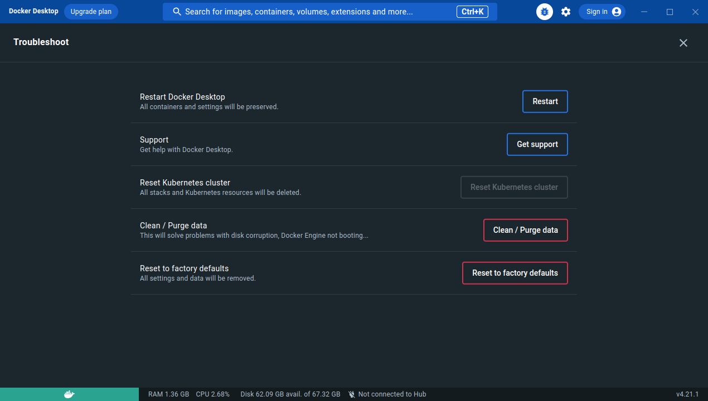
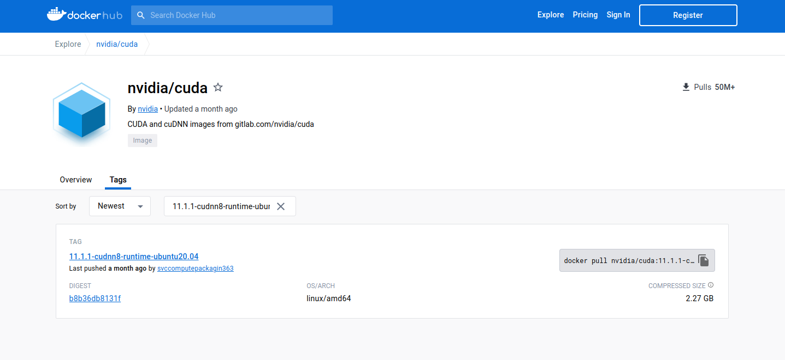

### Ubuntu で nvidia-docker を使って PyTorch の環境を作りたい

- 研究で複数バージョンの CUDA と PyTorch を使い分ける必要があったりします
- 今回は Docker を使って複数バージョンの環境を構築してみます
- Docker イメージは `nvidia-docker` を使います

**前準備**

- https://matsuand.github.io/docs.docker.jp.onthefly/config/containers/resource_constraints/#gpu

- まずは Docker で GPU を認識するために必要なパッケージなどをインストールします

```
    sudo apt install nvidia-container-runtime
    # インストール確認
    which nvidia-contaier-runtime-hook

    sudo apt install nvidia-docker2
```

- デーモンの再起動

  **Docker Engine の場合**

  ```
      sudo service docker restart
  ```

  **Docker Desktop の場合**

  - 虫さんをクリックして restart できる

    

### Docker イメージの作成

- 作成したい環境の `nvidia-docker` イメージを選びます
- https://hub.docker.com/r/nvidia/cuda/tags から 必要な CUDA のバージョンのイメージを選択

- 私は CUDA 11.1 or CUDA 11.7 を使うことが多いので，`nvidia/cuda:11.1.1-cudnn8-runtime-ubuntu20.04` or `nvidia/cuda:11.7.1-cudnn8-runtime-ubuntu20.04` を使ってみます
  

- 選んだイメージをベースに `Dockerfile` を作ります
- サンプル -> `docker/pytorch/Dockerfile`

```Dockerfile
  FROM nvidia/cuda:11.1.1-cudnn8-runtime-ubuntu20.04

  (略)
```

**Dockerfile で PyTorch をインストールしてみる**

- https://download.pytorch.org/whl/torch_stable.html で CUDA のバージョンに合った PyTorch を探します
- いくつか例を載せておきます

  **CUDA11.1**

  - `cu111/torch-1.9.0%...`，`cu111/torchvision-0.10.0%...`があるので，pip でインストールようにしておく

  ```Dockerfile
    pip3 install --no-cache-dir torch==1.9.0+cu111 torchvision==0.10.0+cu111 -f https://download.pytorch.org/whl/torch_stable.html
  ```

  **CUDA11.7**

  - `cu117/torch-1.13.0%...`，`cu117/torchvision-0.14.0%...`があるので，pip でインストールようにしておく

  ```Dockerfile
    pip3 install torch==1.13.0+cu117 torchvision==0.14.0+cu117 -f https://download.pytorch.org/whl/torch_stable.html
  ```

  **CUDA11.7, PyTorch 2.0**

  - `cu117/torch-2.0.0%...`，`cu117/torchvision-0.15.0%...`があるので，pip でインストールようにしておく

  ```Dockerfile
    pip3 install torch==2.0.0+cu117 torchvision==0.15.0+cu117 -f https://download.pytorch.org/whl/torch_stable.html
  ```

### Docker コンテナの起動

- ひとまず，`docker compose up`で起動できるようにしてあります

```bash
  docker compose up -d
```

**pytorch で GPU を認識できるか確認**

```
  >>> import torch
  >>> print(torch.cuda.get_device_name())
  NVIDIA GeForce RTX 3060 Ti
```

### コンテナに GPU を割り当てる

- すでに設定してあるので，読み飛ばしても大丈夫です
- 作成したイメージをベースに GPU を割り当ててコンテナを起動してみます
- 要点を以下にまとめておきます

**docker run で GPU を割り当てたい**

- `--gpus all`を指定する
- `nvidia-smi`できるか確認してみる

```
    docker run -it --rm --gpus all <イメージ名> nvidia-smi
```

**docker compose up で GPU を割り当てたい**

- GPU 接続したい Docker サービスで deploy を指定する
- https://matsuand.github.io/docs.docker.jp.onthefly/compose/gpu-support/

```
    (略)

    deploy:
      resources:
        reservations:
          devices:
            - driver: nvidia
            - count: 1
            - capabilities: [gpu]
```

### VSCode にコンテナをアタッチしたい

- VSCode の拡張機能`remote development`を使うことで，コンテナの中に入って作業ができます

  

- `nvidia-docker`を使う場合は設定しておきましょう

- `.devcontainer/devcontainer.json`を作成します
- Docker サービス名，`docker-compose.yml`へのパスなどを指定します

```
    "name": "PyTorch",
    "dockerComposeFile": "../docker-compose.yml",
    "service": "pytorch",
    "workspaceFolder": "/app",
```

- `ctrl + shift + P`とかでコマンドパレットを開いて，`Dev Containers: Open Folder in Container...`を実行します

  

- アタッチ後は次のようになります
- ターミナルを開くとコンテナの中に入っていることが確認できます

  

- コンテナから抜ける場合は左下の`Dev Container: Python`をクリックして，`Close Remote Connection`をしてください

  

---

- 以上
